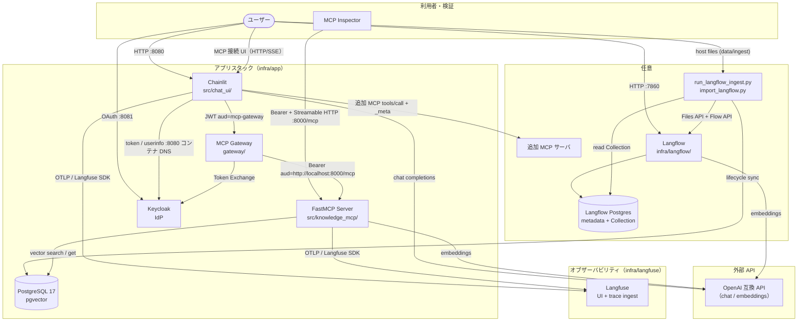
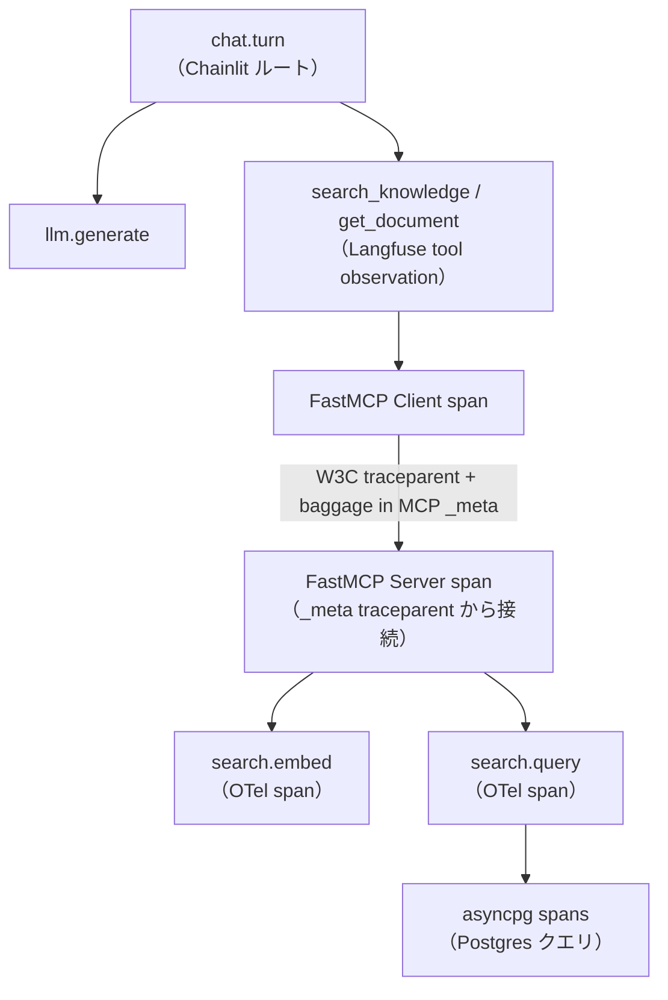

# アーキテクチャ

## コンポーネント

| コンポーネント | 役割 |
|---|---|
| Chainlit（`src/chat_ui/`） | チャット UI、Keycloak OAuth、Langfuse ルートスパン、既定ツールは MCP Gateway 経由、追加 MCP 接続 UI |
| MCP Gateway（`gateway/`） | Chainlit JWT 検証、Keycloak Token Exchange、公式 `mcp>=2` クライアント |
| FastMCP サーバー（`src/knowledge_mcp/`） | Streamable HTTP MCP、Keycloak Resource Server、検索ツール、子スパン |
| PostgreSQL + pgvector | アプリ用ベクトルストアと Chainlit refresh token（pgcrypto） |
| Keycloak | ローカル IdP（realm import）。Chainlit ログインと Token Exchange |
| Langfuse（公式 compose） | トレース取り込みと UI |
| Langflow（任意サイドカー） | ファイル Ingest。専用 DB へ書き、ホスト adapter が `documents` へ複製する |
| MCP Inspector | FastMCP へのプロトコル検証（Bearer 必須） |

## アーキテクチャ図



## 認証フロー（既定ツール）

```text
Keycloak ログイン（client=chainlit）
  -> Chainlit が refresh token をアプリ Postgres に保存
  -> チャット開始時、Chainlit は GET /v1/mcp（role でフィルタ）と GET /v1/mcp/{id}/tools でツールを発見する
  -> 既定ツール実行時、Chainlit は Gateway へ Bearer（aud に mcp-gateway）
  -> Gateway が Token Exchange（client=mcp-gateway、scope=mcp-tools。Keycloak 26 V2 では audience パラメータなし）
  -> knowledge-mcp が JWT を検証（aud に http://localhost:8000/mcp、role mcp-reader）
```

Chainlit トークンは knowledge-mcp に渡さない（[ADR-0012](/decisions/ADR-0012-mcp-gateway-resource-server.md)）。

## レイヤ構成（MCP サーバー）

```text
HTTP トランスポート（Streamable HTTP、Origin 検証）
  -> MCP ツール（search_knowledge, get_document）
    -> SearchService
      -> EmbeddingClient（OpenAI 互換 API）
      -> VectorRepository（asyncpg + pgvector）
```

## トレース伝播



- Chainlit が `chat.turn` と `llm.generate` 観測を作成
- 既定の knowledge-mcp 呼び出しは Chainlit が Gateway へ HTTP し、Gateway が公式 MCP クライアントで `_meta` に W3C トレースコンテキストを注入する
- UI から接続した追加 MCP は公式 SDK の `ClientSession.call_tool(..., meta=...)` で同じ `_meta` を注入
- FastMCP Server が `_meta` を extract し SERVER スパンを子として接続する。baggage により Langfuse はこれらのスパンを追加ルートにしない
- カスタム OTel スパン: `search.embed`、`search.query`（MCP server span の子。Langfuse 独立トレースにはしない）
- Postgres クライアントスパンは `opentelemetry-instrumentation-asyncpg`
- Langfuse への export は SDK デフォルト（Langfuse / gen_ai / 既知 LLM instrumentor）に加え `fastmcp` と `opentelemetry.instrumentation.asyncpg` を許可する

compose 構成は [インフラ](/current/infrastructure.md) を参照。
