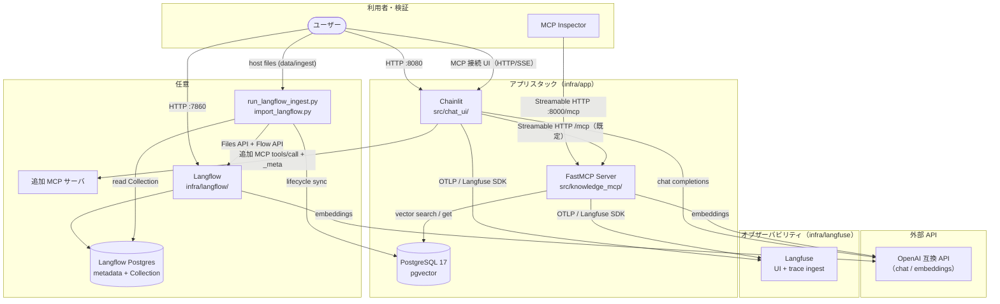
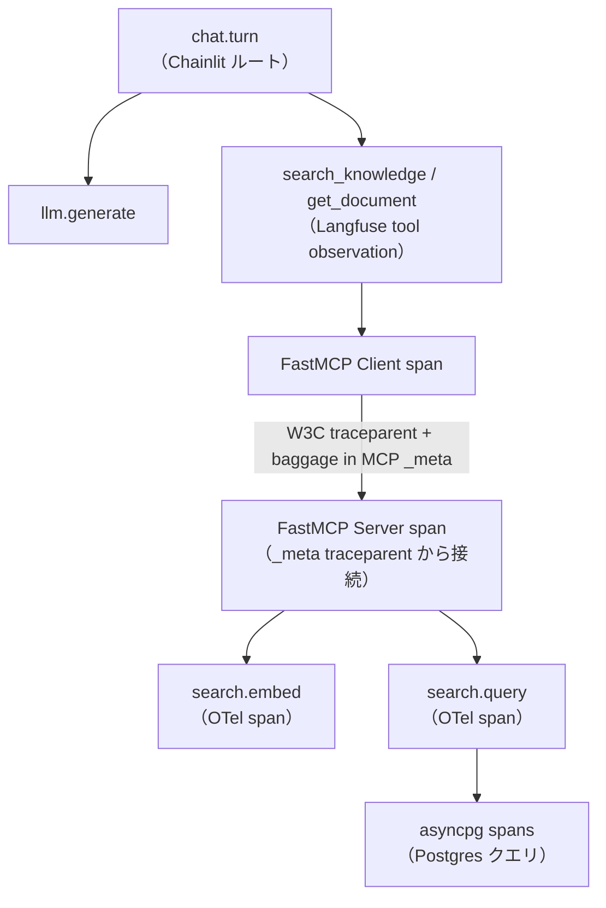

# アーキテクチャ

## コンポーネント

| コンポーネント | 役割 |
|---|---|
| Chainlit（`src/chat_ui/`） | チャット UI、Langfuse ルートスパン、既定 FastMCP クライアント、追加 MCP 接続 UI |
| FastMCP サーバー（`src/knowledge_mcp/`） | Streamable HTTP MCP、検索ツール、子スパン |
| PostgreSQL + pgvector | アプリ用ベクトルストア（Langfuse DB・Langflow DB とは分離） |
| Langfuse（公式 compose） | トレース取り込みと UI |
| Langflow（任意サイドカー） | ファイル Ingest。専用 DB へ書き、ホスト adapter が `documents` へ複製する |
| MCP Inspector | FastMCP へのプロトコル検証 |

## アーキテクチャ図



## レイヤ構成（MCP サーバー）

```text
HTTP トランスポート（Streamable HTTP、Origin 検証）
  -> MCP ツール（search_knowledge, get_document）
    -> SearchService
      -> EmbeddingClient（OpenAI 互換 API）
      -> VectorRepository（asyncpg + pgvector）
```

## トレース伝播



- Chainlit が `chat.turn` と `llm.generate` 観測を作成
- 既定の knowledge-mcp 呼び出しは FastMCP Client の native telemetry で `_meta` に W3C トレースコンテキストを注入する。Langfuse 向けに `baggage`（`langfuse_trace_id`）も載せる
- UI から接続した追加 MCP は公式 SDK の `ClientSession.call_tool(..., meta=...)` で同じ `_meta` を注入
- FastMCP Server が `_meta` を extract し SERVER スパンを子として接続する。baggage により Langfuse はこれらのスパンを追加ルートにしない
- カスタム OTel スパン: `search.embed`、`search.query`（MCP server span の子。Langfuse 独立トレースにはしない）
- Postgres クライアントスパンは `opentelemetry-instrumentation-asyncpg`
- Langfuse への export は SDK デフォルト（Langfuse / gen_ai / 既知 LLM instrumentor）に加え `fastmcp` と `opentelemetry.instrumentation.asyncpg` を許可する

compose 構成は [インフラ](/current/infrastructure.md) を参照。
