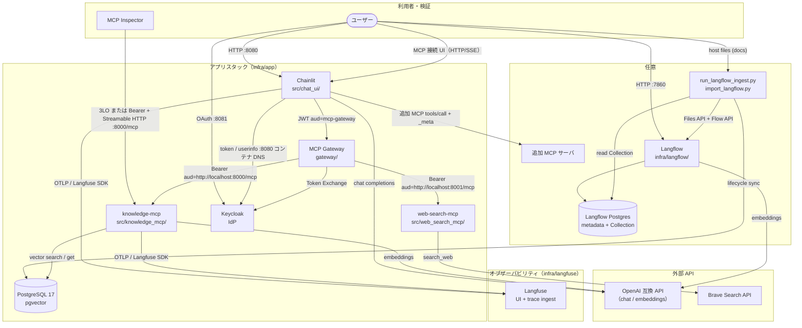
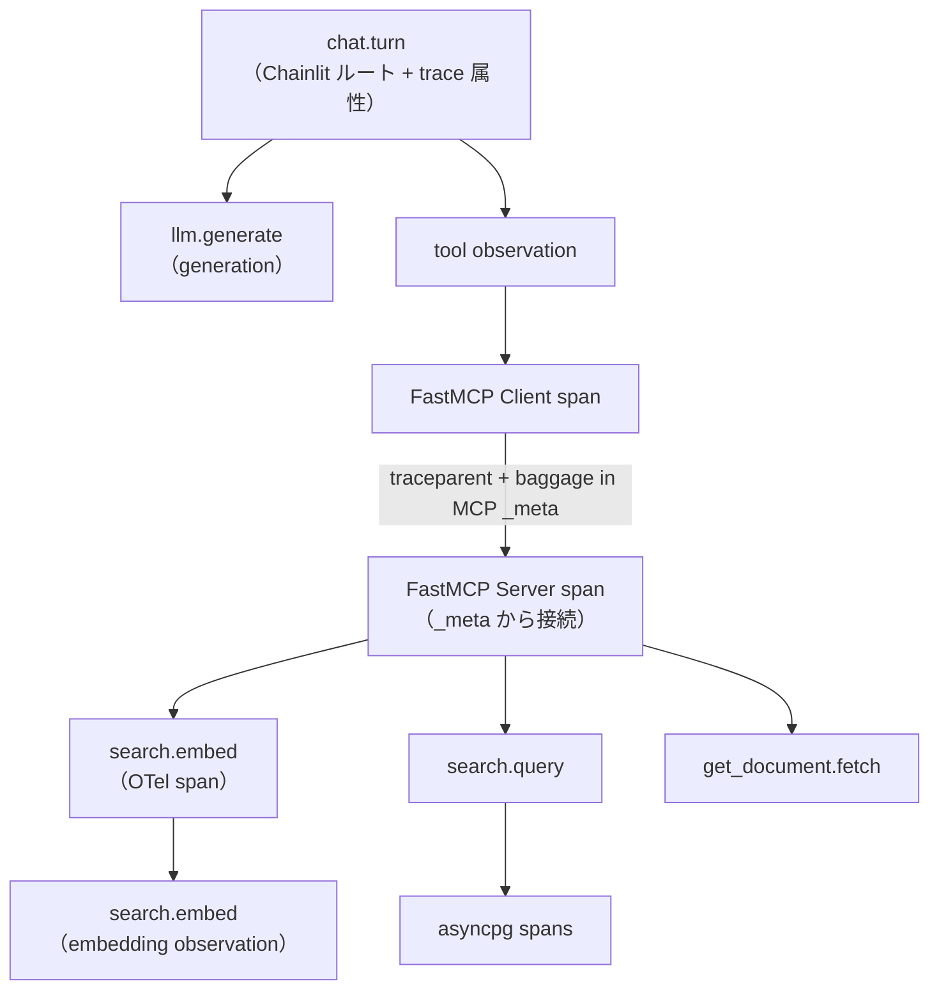

# アーキテクチャ

## コンポーネント

| コンポーネント | 役割 |
|---|---|
| Chainlit（`src/chat_ui/`） | チャット UI、Keycloak OAuth、Langfuse ルートスパン、既定ツールは MCP Gateway 経由（knowledge / web-search）、追加 MCP 接続 UI |
| MCP Gateway（`gateway/`） | Chainlit JWT 検証、Keycloak Token Exchange、サーバー単位 Streamable HTTP、下流は公式 `mcp>=2` |
| FastMCP サーバー（`src/knowledge_mcp/`） | Streamable HTTP MCP、Keycloak Resource Server、ベクトル検索ツール、子スパン |
| FastMCP サーバー（`src/web_search_mcp/`） | Streamable HTTP MCP、Keycloak Resource Server、Brave Web 検索ツール、子スパン |
| PostgreSQL + pgvector | アプリ用ベクトルストアと Chainlit refresh token（pgcrypto） |
| Keycloak | ローカル IdP（realm import）。Chainlit ログイン、Token Exchange、直結 MCP の Authorization Server |
| Langfuse（公式 compose） | トレース取り込みと UI |
| Langflow（任意サイドカー） | ファイル Ingest。専用 DB へ書き、ホスト adapter が `documents` へ複製する |
| MCP Inspector | FastMCP へのプロトコル検証。直結は 3LO（OAuth）、非対話は Bearer |

## アーキテクチャ図



## 認証フロー（既定ツール）

詳細なシーケンス（claim、role フィルタ、失敗時、Inspector / 追加 MCP）は [認証認可](/current/features/authentication.md)。

```text
Keycloak ログイン（client=chainlit）
  -> Chainlit が refresh token をアプリ Postgres に保存
  -> プラグ UI の POST /mcp で Chainlit は catalog url へ MCP セッションを張り tools/list する（role フィルタは GET /v1/mcp）
  -> 既定ツール実行時、Chainlit の Gateway MCP セッション経由で POST /mcp/{id} tools/call（Bearer は aud に mcp-gateway）
  -> Gateway が Token Exchange（client=mcp-gateway。knowledge は scope=mcp-tools、web-search は scope=web-search-mcp-tools。Keycloak 26 V2 では audience パラメータなし）
  -> 各 MCP が JWT を検証（knowledge: aud=http://localhost:8000/mcp、role knowledge-mcp-reader。web-search: aud=http://localhost:8001/mcp、role web-search-reader）
```

Chainlit トークンは knowledge-mcp に渡さない（[ADR-0012](/decisions/ADR-0012-mcp-gateway-resource-server.md)）。直結クライアントの 3LO は [ADR-0014](/decisions/ADR-0014-mcp-direct-three-legged-oauth.md)。

## レイヤ構成（MCP サーバー）

```text
HTTP トランスポート（Streamable HTTP、Origin 検証）
  -> MCP ツール（search_knowledge, get_document）
    -> SearchService
      -> EmbeddingClient（OpenAI 互換 API）
      -> VectorRepository（asyncpg + pgvector）
```

## トレース伝播

メタデータの正本は [Langfuse OTEL トレーシング](/current/features/tracing.md)。以下は構成概要。



- Chainlit が `chat.turn` / `llm.generate` と tool observation を作成し、`propagate_attributes` で `user.id` / `session.id` 等を子 span へ伝播する
- 既定 Gateway MCP は Chainlit FastMCP Client → Gateway `/mcp/{server_id}` → knowledge-mcp または web-search-mcp。Gateway は `_meta` を転送するのみ
- 追加 MCP は `ClientSession.call_tool(..., meta=...)` で同じ `_meta` を注入
- MCP サーバーは `search.embed`（OTel + embedding observation）、`search.query`、`get_document.fetch` と asyncpg スパンをネストする
- Langfuse export フィルタと秘匿ルールは [トレーシング](/current/features/tracing.md) を参照

compose 構成は [インフラ](/current/infrastructure.md) を参照。
