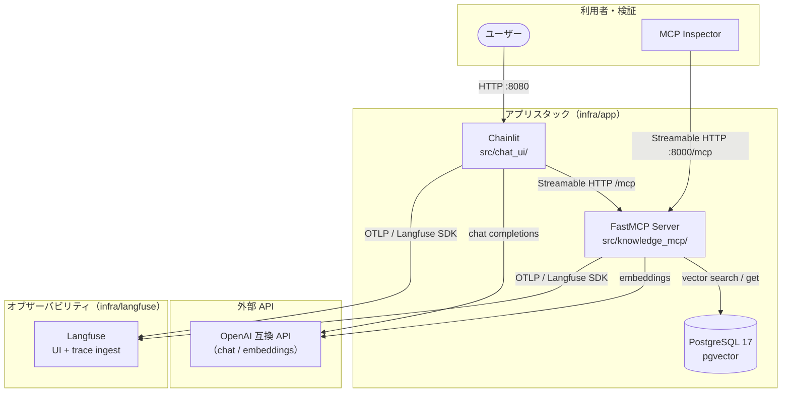
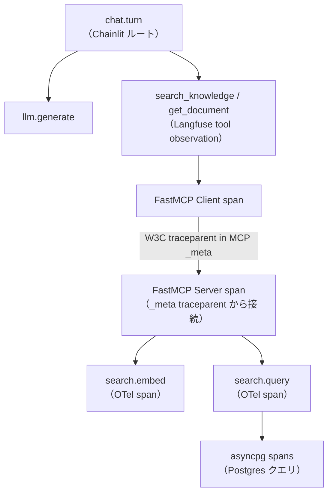

# アーキテクチャ

## コンポーネント

| コンポーネント | 役割 |
|---|---|
| Chainlit（`src/chat_ui/`） | チャット UI、Langfuse ルートスパン、FastMCP クライアント |
| FastMCP サーバー（`src/knowledge_mcp/`） | Streamable HTTP MCP、検索ツール、子スパン |
| PostgreSQL + pgvector | アプリ用ベクトルストア（Langfuse DB とは分離） |
| Langfuse（公式 compose） | トレース取り込みと UI |
| MCP Inspector | FastMCP へのプロトコル検証 |

## アーキテクチャ図



## レイヤ構成（MCP サーバー）

```text
HTTP トランスポート（Streamable HTTP、Origin 検証）
  -> MCP ツール（search_knowledge, get_document）
    -> SearchService
      -> EmbeddingClient（OpenAI 互換 API）
      -> VectorRepository（asyncpg + pgvector）
```

## トレース伝播



- Chainlit が `chat.turn` と `llm.generate` 観測を作成
- FastMCP Client が W3C トレースコンテキストを MCP `_meta` に注入（native telemetry）
- FastMCP Server が `_meta` を extract し SERVER スパンを子として接続
- カスタム OTel スパン: `search.embed`、`search.query`（MCP server span の子。Langfuse 独立トレースにはしない）
- Postgres クライアントスパンは `opentelemetry-instrumentation-asyncpg`

compose 構成は [インフラ](/current/infrastructure.md) を参照。
