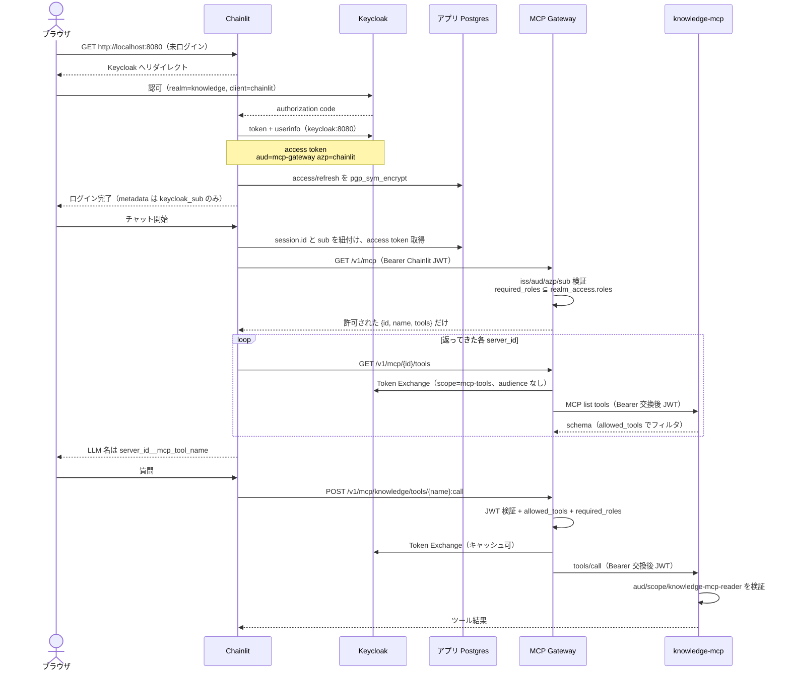

# Chainlit × Gateway × knowledge-mcp の認証認可

未ログインのブラウザが `http://localhost:8080` を開いてから、Gateway 経由で knowledge-mcp のツールを実行するまでの **現行シーケンス** です。なぜこの形かは [ADR-0011](/decisions/ADR-0011-keycloak-chainlit-oauth.md) と [ADR-0012](/decisions/ADR-0012-mcp-gateway-resource-server.md)。UI の見え方は [Chainlit チャット UI](/current/features/ui.md)、HTTP 契約は [MCP ツール契約](/current/features/api.md)、ホストと Compose は [インフラ](/current/infrastructure.md)。

Chainlit の Keycloak トークンは knowledge-mcp に渡さない。

## 登場者と設定の正本

| 登場者 | 役割 | 正本 |
|---|---|---|
| ブラウザ | Chainlit と Keycloak 認可画面だけを見る | — |
| Chainlit | OAuth クライアント。トークン保存。Gateway HTTP クライアント | `src/chat_ui/auth.py`、`token_manager.py`、`gateway_client.py` |
| Keycloak | IdP と Token Exchange | `infra/app/keycloak/knowledge-realm.json` |
| アプリ Postgres | refresh / access の暗号化保存 | `chainlit_oauth_tokens`（pgcrypto） |
| MCP Gateway | Chainlit JWT 検証、role 検査、Token Exchange、下流 MCP 呼び出し | `gateway/`、`infra/app/gateway-registry.yml` |
| knowledge-mcp | Resource Server。交換後 JWT を検証してツールを実行 | `src/knowledge_mcp/auth.py` |

ローカル開発ユーザー:

| ユーザー | パスワード | realm role | Gateway での knowledge |
|---|---|---|---|
| `dev` | `dev` | `knowledge-mcp-reader` あり | 一覧に出る。ツール実行可 |
| `readerless` | `readerless` | `knowledge-mcp-reader` なし | `GET /v1/mcp` から消える。`POST ...:call` は 403 |

サーバーごとの実行条件は Registry の `authorization.required_roles` と Keycloak の `users[].realmRoles` を揃える。ユーザー → サーバーの個別 allowlist は持たない。

## トークンは2種類

| | Chainlit 用（上流） | knowledge-mcp 用（下流） |
|---|---|---|
| 発行 | Keycloak authorization code（client `chainlit`） | Gateway が Token Exchange（client `mcp-gateway`） |
| 主な claim | `aud=mcp-gateway`、`azp=chainlit`、`sub`、`realm_access.roles` | `aud=http://localhost:8000/mcp`、`azp=mcp-gateway`、`scope=mcp-tools`、同じ `sub` と roles |
| 使える先 | Gateway の HTTP API だけ | knowledge-mcp の `/mcp` だけ |
| ブラウザ | 直接持たない（Cookie / Chainlit セッション） | 持たない |

Chainlit 用 JWT に `sub` と roles を載せるため、realm import は `basic` / `profile` / `email` / `roles` / `chainlit-mcp-gateway` を client scope として残す。

## 全体シーケンス

## フェーズ 1 — ログイン（authorization code）

1. 未ログインで Chainlit（`:8080`）を開くとチャットできない。
2. Chainlit は generic OAuth（`OAUTH_GENERIC_NAME=keycloak`）で Keycloak に飛ばす。組み込み Keycloak provider は使わない（ブラウザ用ホストとコンテナ DNS を分けられないため。`OAUTH_KEYCLOAK_NAME=unused`）。
3. **ブラウザ** の認可 URL は `http://localhost:8081`（realm `knowledge`、client `chainlit`、scope `openid profile email`）。
4. **Chainlit コンテナ** の token / userinfo は `http://keycloak:8080`。
5. コールバックは `http://localhost:8080/auth/oauth/keycloak/callback`。
6. Chainlit 2.12 の `GenericOAuthProvider` は `refresh_token` を捨てる。`get_raw_token_response` をラップして token 応答を残す。
7. userinfo の email が識別子（`dev@localhost`）。
8. `oauth_callback` がユーザーを受理する。`cl.User.metadata` に入れるのは `keycloak_sub` だけ。access / refresh は `KeycloakTokenManager` が Postgres に upsert する（`TOKEN_STORE_DATABASE_URL` + `TOKEN_STORE_KEY`）。Chainlit 内蔵 data layer の `DATABASE_URL` は空。

この時点の access token（password grant / code grant とも同じ mapper）:

- `iss` = `http://localhost:8081/realms/knowledge`
- `aud` に `mcp-gateway`（scope `chainlit-mcp-gateway`）
- `azp` = `chainlit`
- `sub`（scope `basic`）
- `realm_access.roles`（scope `roles`）。`dev` は `knowledge-mcp-reader` を含む
- `email` / 表示名（scope `email` / `profile`）

## フェーズ 2 — チャット開始とカタログ（認可の発見）

`on_chat_start`:

1. `keycloak_sub` と Chainlit `session.id` を `chainlit_oauth_tokens` に紐付ける。
2. 保存済み access token を取り出す。期限が近ければ refresh grant。401 後のツール再試行でも同じ refresh を一度だけ使う。
3. `GET {MCP_GATEWAY_URL}/v1/mcp` に `Authorization: Bearer <Chainlit JWT>`。

Gateway の `GET /v1/mcp`:

1. Bearer が無ければ 401 `INVALID_TOKEN`。
2. JWKS で Chainlit JWT を検証する。`iss`、`aud` に `mcp-gateway`、`azp=chainlit`、`sub` 必須。
3. Registry（`infra/app/gateway-registry.yml`）の `enabled: true` を走査する。
4. 各サーバーの `authorization.required_roles` が空でなければ、JWT の `realm_access.roles` がそれをすべて含むこと。満たさないサーバーは **返さない**（404 にはしない。一覧から消す）。
5. 下流 MCP は呼ばない。返すのは `{id, name, tools}`（`allowed_tools`）。

いまの knowledge エントリは `required_roles: [knowledge-mcp-reader]`。`readerless` の応答は knowledge を含まない。そのため Chainlit は `GET /v1/mcp/knowledge/tools` を呼ばず、LLM にも knowledge ツールを載せない。次の Gateway MCP を足すときは、そのサーバー用の realm role を作り Registry の `required_roles` に書く。

`required_roles` が空のサーバーは、有効な Chainlit JWT を持つ全員に出る。

## フェーズ 3 — ツール schema 取得

許可された各 `server_id` に対し `GET /v1/mcp/{server_id}/tools`:

1. 同じ Chainlit JWT を検証する。
2. `enabled` でなければ 404 `MCP_SERVER_NOT_FOUND`。
3. **この GET は `required_roles` を再検査しない**（一覧で既に落としている。直接 URL を叩けば schema は取れる）。
4. Token Exchange してそのサーバーの MCP に list tools する。`authentication.mode` / `resource` / `scopes` が無ければ 500。応答は `allowed_tools` でフィルタする。

## フェーズ 4 — ツール実行（認可の強制）

LLM が `{server_id}__{name}` を選ぶと `POST /v1/mcp/{server_id}/tools/{name}:call`（パスの `{name}` は MCP 名）。body は `{ "arguments": {...} }` だけ。`user_id` は 422。主体は JWT `sub`。

Gateway:

1. Bearer / JWT 検証（フェーズ 2 と同じ）。
2. ツールが `allowed_tools` に無ければ 404 `TOOL_NOT_FOUND`。
3. `required_roles` が空でなければ、Chainlit JWT の roles がそれをすべて含むこと。足りなければ 403 `ACCESS_DENIED`。
4. Token Exchange（次節）。結果は Gateway メモリに短時間キャッシュする。
5. 公式 `mcp>=2` で `http://mcp-server:8000/mcp` を呼ぶ。Bearer は **交換後 JWT**。W3C `traceparent` / baggage は MCP `_meta` に載せる。
6. ホストポートは公開しない。到達元は Chainlit コンテナ（`http://mcp-gateway:8082`）。

401 なら Chainlit は refresh して一度だけ再 POST する。

## フェーズ 5 — Token Exchange（Keycloak 26 V2）

Gateway client `mcp-gateway`（secret、`standard.token.exchange.enabled`）:

| フィールド | 値 |
|---|---|
| `grant_type` | `urn:ietf:params:oauth:grant-type:token-exchange` |
| `subject_token` | Chainlit access token |
| `subject_token_type` | `urn:ietf:params:oauth:token-type:access_token` |
| `scope` | そのサーバーの Registry `authentication.scopes`（knowledge は `mcp-tools`） |
| `audience` | **送らない** |

V2 の `audience` は「すでに付く aud の制限」であり、client id `knowledge-mcp` 向けの交換ではない。`audience=knowledge-mcp` は `Requested audience not available`（400）。Resource `aud` は `mcp-gateway` の default scope `mcp-tools` の custom audience mapper（`http://localhost:8000/mcp`）が付ける。

Gateway は交換後 JWT を再検証する。`aud` にそのサーバーの Registry `authentication.resource` が無ければ 502 `TOKEN_AUDIENCE_MISMATCH`。`resource` / `scopes` / `mode` の欠落を knowledge 向け値で補完しない。

## フェーズ 6 — knowledge-mcp（Resource Server）

Compose では `MCP_JWKS_URI` があるので HTTP Bearer 必須。

1. FastMCP `JWTVerifier`: JWKS、`iss`、`aud=http://localhost:8000/mcp`、必須 scope `mcp-tools`。
2. PRM の `resource` も `http://localhost:8000/mcp`（JWT `aud` と同じ）。
3. 各ツール `auth=require_mcp_reader`: 交換後 JWT の `realm_access.roles` に `knowledge-mcp-reader`。無ければツール拒否。
4. 通れば SearchService（埋め込み + pgvector）。

`MCP_JWKS_URI` 未設定の in-process テストだけ Bearer を要求しない。`token is None` のとき `require_mcp_reader` は通す。

## 失敗時

| 状況 | 観測 |
|---|---|
| 未ログインでチャット | Chainlit が Keycloak へ送る |
| Gateway に Bearer なし | 401 `INVALID_TOKEN` |
| `aud` に `mcp-gateway` がない / `azp` が `chainlit` でない | 403 `INVALID_AUDIENCE` |
| 期限切れ JWT | 401 `TOKEN_EXPIRED`（Chainlit は refresh して再試行） |
| `knowledge-mcp-reader` なしで `GET /v1/mcp` | knowledge が配列に無い（200） |
| `knowledge-mcp-reader` なしで `POST ...:call` | 403 `ACCESS_DENIED` |
| 未知 / disabled の `server_id` | 404 `MCP_SERVER_NOT_FOUND` |
| Registry に `authentication.resource` / `scopes` が無い | 500 `INVALID_REGISTRY` |
| `authentication.mode` が `keycloak_token_exchange` でない | 500 `UNSUPPORTED_AUTH_MODE` |
| 許可外ツール名 | 404 `TOOL_NOT_FOUND` |
| Token Exchange が `audience=knowledge-mcp` | Keycloak 400。現行実装は送らない |
| knowledge-mcp に Chainlit JWT または無認証 | JWT / scope / role 検証で拒否 |
| body に `user_id` | 422 |

## このシーケンスに乗らない経路

**プラグ UI（MCP Servers）**

Registry の enabled サーバーを `mcp-autoload.js` が載せる。role では隠さない。プラグ UI の接続 / 切断は `/gateway-mcp` でセッションの利用フラグだけを更新する（実 MCP セッションは張らない。トークンも渡さない）。切断したサーバーのツールは次のチャットターンから LLM に載らない。新しいチャットでは再び有効。

**追加 MCP（allowlist）**

`.chainlit/config.toml` の `user_servers.allowed_urls`。Keycloak / Gateway / Token Exchange は使わない。origin allowlist はユーザーごとではない。

**MCP Inspector**

`scripts/mcp_dev_token.py` が password grant + 同じ Token Exchange（`audience` なし）を行い、`http://127.0.0.1:8000/mcp` に Bearer を付ける。Chainlit は介さない。

ローカル HTTP は許容。TLS / mTLS / CIMD / ユーザー単位のサーバー allowlist はこのスライスの対象外。
