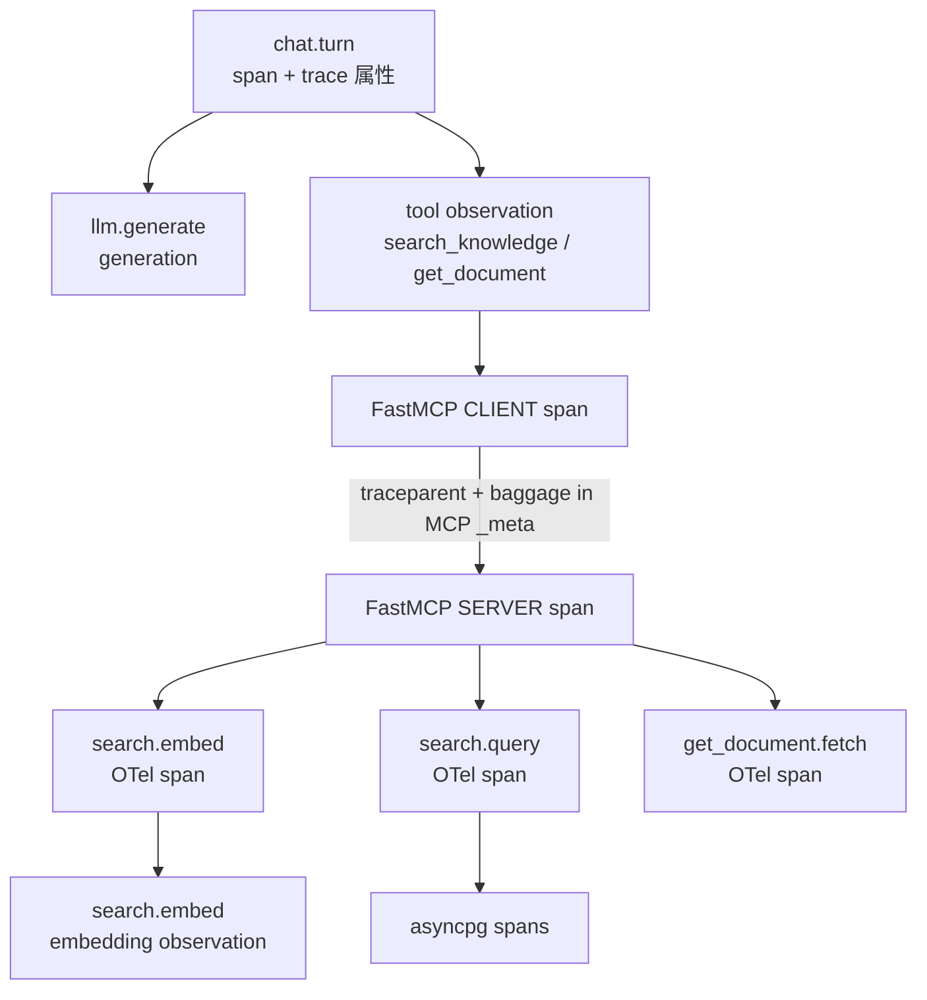

# Langfuse OTEL トレーシング

## 目的

1 チャットターンあたり Langfuse 一覧に **ルート 1 件**（`chat.turn`）を表示し、LLM・MCP クライアント/サーバー・embedding・Postgres クライアントを **同一 trace 内** にネストする。設計判断は [ADR-0004](/decisions/ADR-0004-langfuse-mcp-meta-tracing.md)。Compose と手動検証手順は [インフラ](/current/infrastructure.md)。

## コード入口

| コンポーネント | 初期化 | 主な観測 |
|---|---|---|
| Chainlit | `src/chat_ui/app.py`（FastMCP import 前） | `chat.turn`, `llm.generate`, tool observation |
| MCP サーバー | `src/knowledge_mcp/server.py`（FastMCP import 前） | FastMCP server span, `search.embed` / `search.query` |
| 共通 | `src/knowledge_mcp/tracing.py` | SDK 初期化、`_meta` 注入、ヘルパー |

Langfuse キー未設定時は **no-op**（サービスは起動可能）。

## 観測ツリー（1 ターン）



- Gateway プロセスは Langfuse export しない。W3C / baggage を下流 `_meta` へ転送するのみ（[ADR-0012](/decisions/ADR-0012-mcp-gateway-resource-server.md)、[ADR-0013](/decisions/ADR-0013-mcp-gateway-per-server-streamable-http.md)）。
- Langfuse 有効時、`search.embed` は OTel スパン（FastMCP server の子）の内側に **embedding observation** をネストする。無効時は OTel スパンのみ。

## 環境変数

| 変数 | 必須 | 用途 |
|---|---|---|
| `LANGFUSE_PUBLIC_KEY` | トレース送信時 | Langfuse プロジェクト公開鍵 |
| `LANGFUSE_SECRET_KEY` | トレース送信時 | Langfuse プロジェクト秘密鍵 |
| `LANGFUSE_HOST` | 推奨 | Langfuse Web URL（compose 内は `http://langfuse-web:3000`） |
| `LANGFUSE_TRACING_ENABLED` | 任意 | `false` で明示 no-op（既定 `true`） |
| `LANGFUSE_TRACING_ENVIRONMENT` | 任意 | プロセス共通の `langfuse.environment`（例: `local`） |
| `LANGFUSE_RELEASE` | 任意 | プロセス共通の `langfuse.release`（例: git SHA） |
| `FASTMCP_TELEMETRY_MODE` | 推奨 | 既定 `native`（MCP `_meta` 伝播） |

初回は Langfuse UI でサインアップし API キーを `.env` にコピーする（[インフラ](/current/infrastructure.md)）。

## トレース相関属性

Chainlit の `on_message` 内で `chat_trace_attributes` → Langfuse `propagate_attributes` を呼び、`as_baggage=True` で MCP 下流へ伝播する。

| Langfuse / OTEL 属性 | 送信元 | 値の例 |
|---|---|---|
| `user.id` | Chainlit ログインユーザ | Keycloak `sub`（なければ `identifier`） |
| `session.id` | Chainlit | `cl.context.session.id` |
| `langfuse.trace.tags` | 固定 + 将来拡張 | `["chainlit"]` |
| `langfuse.trace.metadata.component` | 固定 | `chainlit` |
| `langfuse.trace.metadata.chat_model` | 設定 | `CHAT_MODEL` |
| `langfuse.environment` | env / SDK | `LANGFUSE_TRACING_ENVIRONMENT` |
| `langfuse.release` | env / SDK | `LANGFUSE_RELEASE` |

### `chat.turn` の入出力

| 属性 | 内容 |
|---|---|
| input | `{"content": "<ユーザー発話>"}` |
| output | `{"content": "<最終 assistant 応答>"}` |

`@observe(capture_input=False, capture_output=False)` とし、`update_current_turn_io` で明示設定する。

## 観測別メタデータ

### `llm.generate`（generation）

| 属性 | 内容 |
|---|---|
| `langfuse.observation.type` | `generation` |
| `langfuse.observation.model.name` | `CHAT_MODEL` |
| `langfuse.observation.usage_details` | OpenAI 互換 API の `prompt_tokens` / `completion_tokens` / `total_tokens` → `input` / `output` / `total` |
| `langfuse.observation.metadata.tool_choice` | `auto` |

実装: `@observe(name="llm.generate", as_type="generation")` + `record_generation_result`。

### ツール observation（Chainlit 側）

Gateway / 追加 MCP セッションの `tools/call` を Langfuse `tool` observation として記録。

| observation metadata キー | 意味 |
|---|---|
| `tool.route` | `gateway` / `session` / `unknown` |
| `tool.llm_name` | LLM が選んだ function 名 |
| `tool.server_id` | Gateway サーバー ID（route=gateway 時） |
| `tool.mcp_name` | 下流 MCP ツール名 |
| `tool.session` | 追加 MCP セッション名（route=session 時） |

input / output はツール引数と結果 JSON。`get_document` の `content` は先頭 500 文字に truncate（[API 契約](/current/features/api.md)）。

### MCP サーバー（FastMCP server span）

| 項目 | 内容 |
|---|---|
| input / output | `record_tool_input` / `record_tool_output`（サーバー span に付与） |
| 子 OTel: `search.embed` | `search.query_length`（Langfuse 無効時の OTel metadata） |
| 子 OTel: `search.query` | `search.result_count`, `search.top_similarity` |
| 子 OTel: `get_document.fetch` | `document.found`, `document.id_length` |

### `search.embed`（embedding observation）

Langfuse 有効時のみ。OTel `search.embed` スパンの子。

| 属性 | 内容 |
|---|---|
| `langfuse.observation.type` | `embedding` |
| `langfuse.observation.model.name` | `EMBEDDING_MODEL` |
| input | `input_length`, `dimensions` |
| `langfuse.observation.usage_details` | API `usage.total_tokens` → `total`（取得時のみ） |

## MCP `_meta` 伝播

FastMCP native telemetry（`FASTMCP_TELEMETRY_MODE=native`）に加え、`inject_langfuse_propagated_meta` が以下を MCP `_meta` へ載せる。

| `_meta` キー | 内容 |
|---|---|
| `traceparent` | W3C Trace Context |
| `tracestate` | W3C（存在時） |
| `baggage` | W3C Baggage（`langfuse_trace_id` および `propagate_attributes(..., as_baggage=True)` の属性） |

Gateway は受信 `_meta` を下流 knowledge-mcp へマージ転送する。MCP サーバーは `extract_langfuse_propagated_context` で親 span に接続する。

## Export フィルタ

Langfuse SDK 4 既定に加え、`should_export_langfuse_span` で以下のみ追加許可する。

- `fastmcp`
- `opentelemetry.instrumentation.asyncpg`

**送らない例**: `opentelemetry.instrumentation.httpx`（embedding の HTTP クライアントノイズ回避）。

## 秘匿・ truncate

- API キー、embedding ベクトル、document 全文を span にログしない
- ツール output の `content` フィールドは 500 文字で truncate（`sanitize_tool_output_for_trace`）
- `user.id` は Keycloak `sub` を優先（集計用。メール等の PII を trace metadata に載せない）

## スコープ外（意図的未実装）

| 項目 | 理由 |
|---|---|
| OTel metrics / logs パイプライン | [ADR-0004](/decisions/ADR-0004-langfuse-mcp-meta-tracing.md) でトレースのみ |
| Gateway からの Langfuse export | 伝播のみ。export は Chainlit / mcp-server |
| `langfuse.openai` ラッパー | 素の `AsyncOpenAI` + `@observe` + `record_generation_result` で usage を付与 |
| `sample_rate`, `mask_otel_spans` | 将来の運用要件に応じて検討 |
| `langfuse.trace.public` | 共有トレース要件が出たら追加 |

## 検証

### 自動

```bash
uv run pytest tests/test_trace_propagation.py tests/test_langfuse_span_export.py tests/test_tracing_metadata.py tests/test_tool_trace_output.py
```

### 手動（Langfuse UI）

[インフラ](/current/infrastructure.md) の「トレース検証チェックリスト」に従う。

## 関連ドキュメント

- [UI（Chainlit）](/current/features/ui.md) — OAuth、Gateway 配線、`_meta` 注入
- [API（MCP ツール）](/current/features/api.md) — ツール I/O と truncate
- [バックエンド](/current/features/backend.md) — SearchService
- [ADR-0003](/decisions/ADR-0003-chainlit-traced-client.md) — traced クライアント UI
- [ADR-0004](/decisions/ADR-0004-langfuse-mcp-meta-tracing.md) — `_meta` 伝播の設計判断
